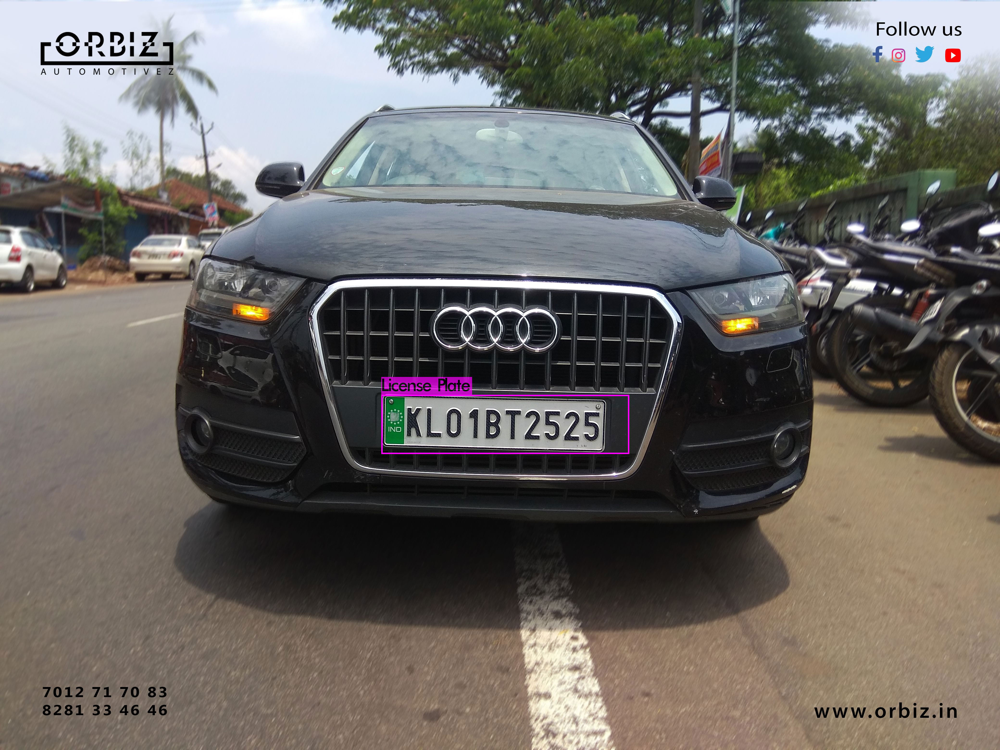
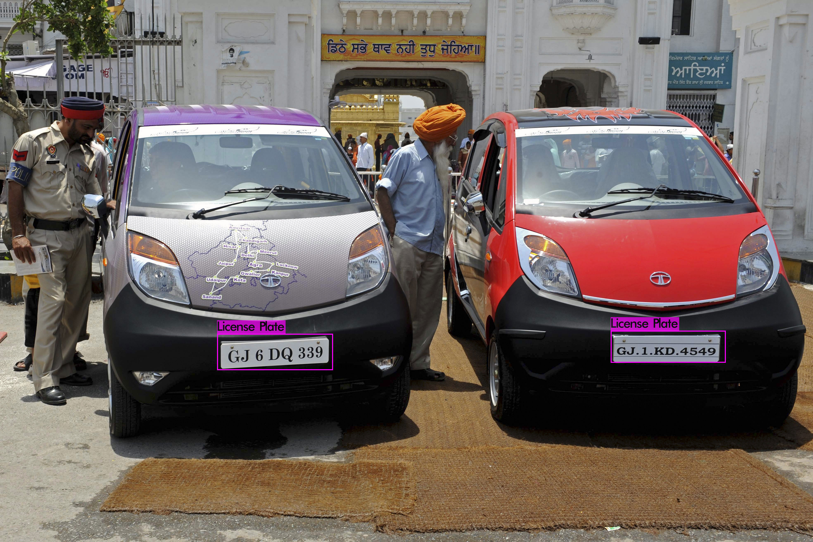
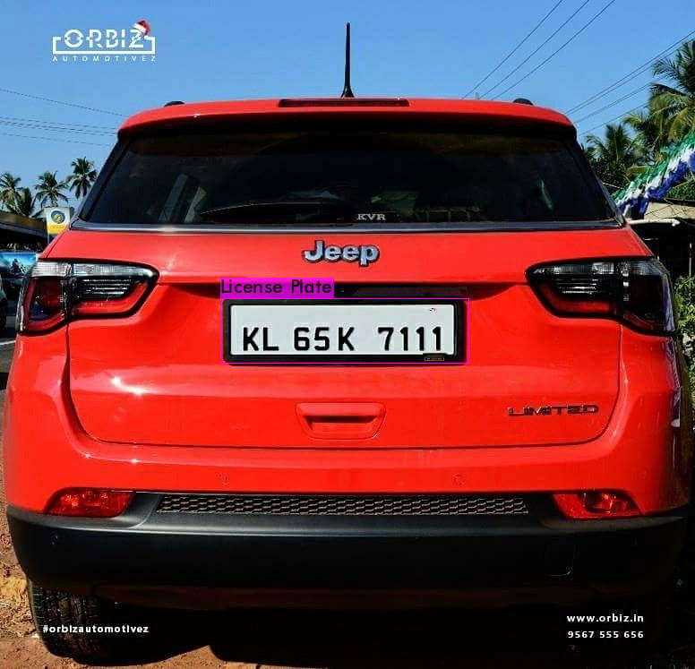
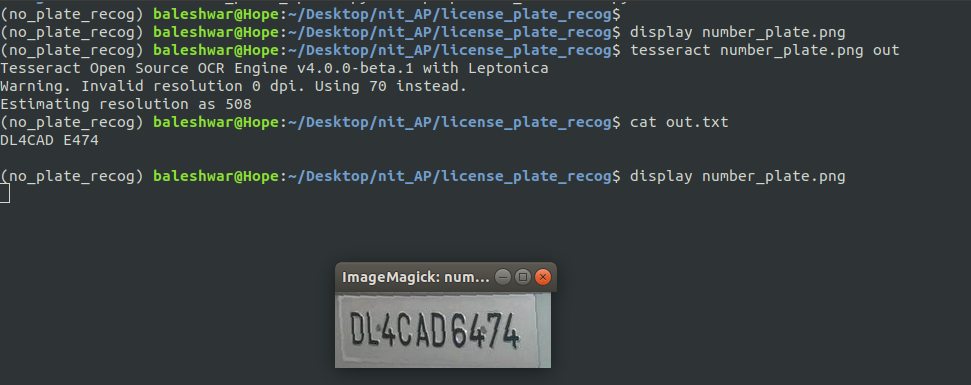
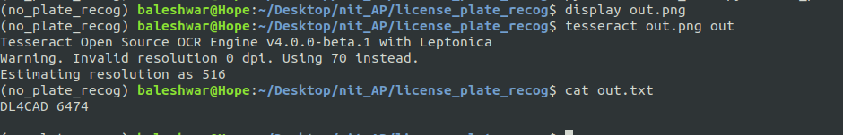
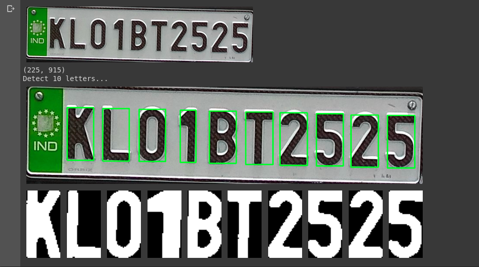
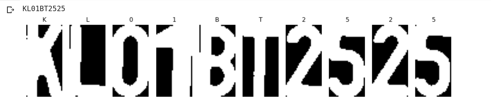
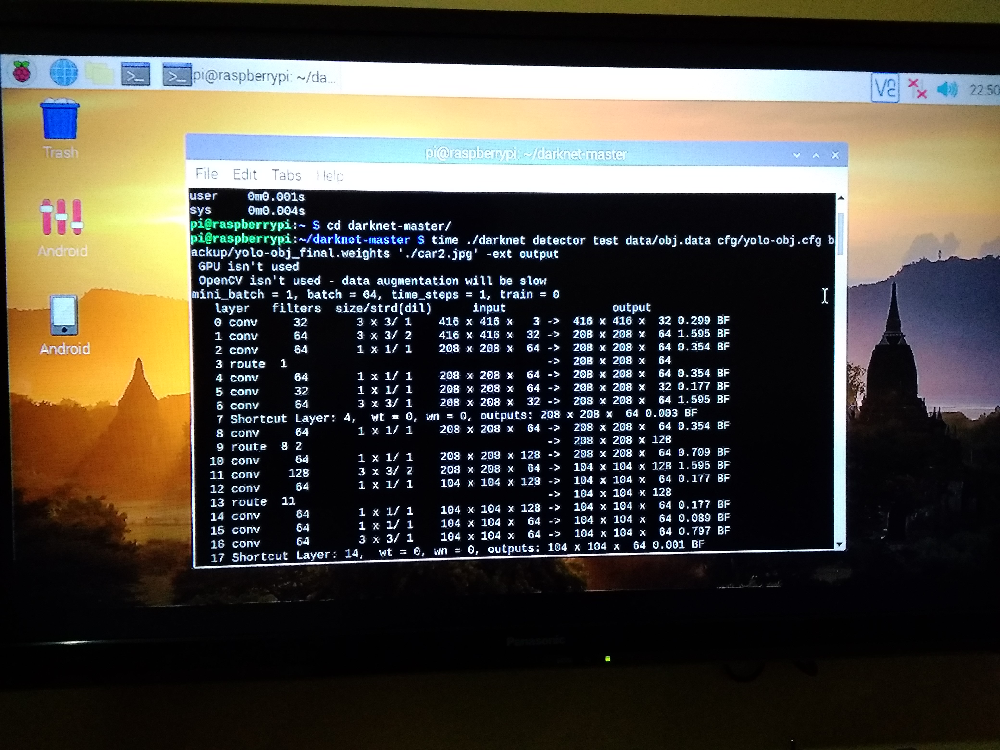
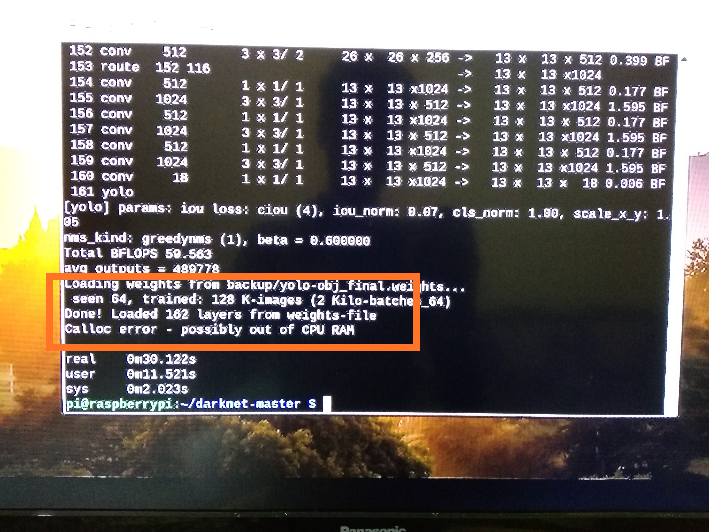
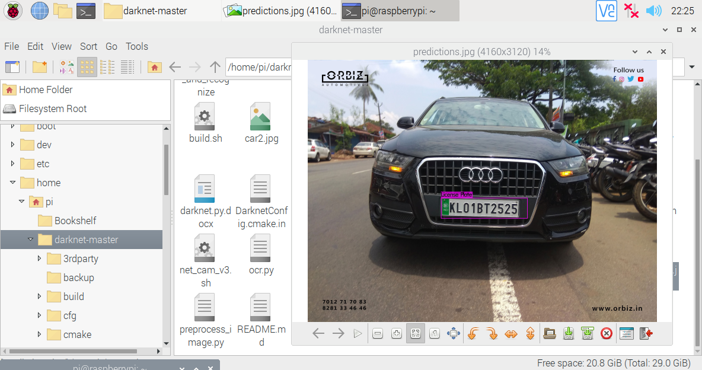

# ALPR4Rural_India
Automatic License Plate Detection and Recognition for Rural India

---
## About
This project was done as a Summer Research Intern at the National Institute of Technology (NIT ) Andhra Pradesh along with my fellow intern [Ritish Kumar Tiwari ](https://github.com/ritishtiwari) of the National Institute of Technology (NIT ) Raipur , under the guidance of [Dr Sri Phani Krishna Karri](https://nitandhra.ac.in/dept/eee/20164) of the Department of Electrical Engineering , NIT Andhra Pradesh. Ritish worked on the License Plate detection part using YOLO V4 alogirithm and I worked on the Character Segmentation of License Plate Image Using OpenCV and License Plate Recognition part using Tesseract and MobileNet V2 .

---
## Problem Statement
Metropolitan cities and urban areas with adequate infrastructure , it is easy to implement and deploy License plate detection and recognition systems with available CCTV cameras in the traffic signals and good network speed , but the same is not true in case of remote rural areas of India wherein there is no  such proper infrastructure and good network speed to deploy such systems . In such a scenario , there are more possibilities of traffic law violations in the rural areas which can lead to more road accidents and casualties . There is a need of such a system for rural settings with its own specific constraints which will help Indian roads more safe to use .

---
## Solution Design
The idea here is to design and develop an “Automatic License Plate Detection and Recognition system ” for rural India which can work as a standalone system . The system should be deployable in a Smartphone or a single board computer like Raspberry Pi .  
__Design Constraints__-  
1.It should be based on Open source softwares .  
2.It must work offline .  
3.It should be deployable in a Raspberry Pi / and Smartphone  
4.It should not make use of any Cloud services like Google Cloud Platform , Microsoft Azure ,etc.  
The proposed solution involves three stages - 
1.License plate detection ( from an image of a vehicle ) - __YOLO V4 algorithm__  
2.Character segmentation - __OpenCV library__  
3.License plate recognition - __Tesseract and MobileNet V2__  

---
## License Plate Detection Results Using YOLO v4
   

   

   

---
## License Plate Recognition Results Using Tesseract

Fig :- License Plate Recognition Results without image pre-processing( Second line from the bottom)  
 
Fig :- License Plate Recognition Results with image pre-processing( First line from the bottom)  

---
## Character Segmentation Results Using OpenCV
   

---
# Character Recognition Results Using MobileNet v2
   

---
## Model Deployment on Raspberry Pi 3B
   
   
 
Fig - The YOLO v4 prediction is by default stored in predictions.jpg within the "darknet-master" folder  
